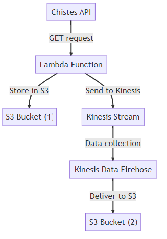

# Proyecto AWS CloudFormation: Kinesis a S3

Este proyecto implementa una arquitectura serverless en AWS que recoge chistes de una API, los almacena en un bucket de S3 y luego los transmite a un stream de Kinesis. Los datos transmitidos son finalmente entregados a otro bucket de S3 mediante Kinesis Data Firehose.

### Arquitectura del sistema:

 La arquitectura del sistema se puede visualizar de la siguiente manera:

 -  Una función Lambda hace una petición GET a la API de chistes para obtener un chiste aleatorio.
 - La función Lambda almacena el chiste en un bucket de S3.
 - La función Lambda también envía el chiste a un stream de Kinesis.
 - Kinesis Data Firehose recoge los datos del stream de Kinesis y los entrega a otro bucket de S3.

### Despliegue

Para desplegar esta arquitectura, necesitas tener instalado el AWS CLI y tener configuradas las credenciales de AWS. A continuación, puedes utilizar el siguiente comando para crear la stack de CloudFormation:

`aws cloudformation create-stack --stack-name mi-stack --template-body file://template.yaml`

Reemplaza "mi-stack" con el nombre que quieras darle a tu stack.